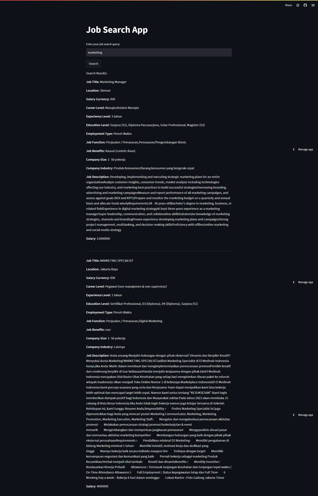

# Job Search App By Daffa

Hi! This is my first app of impmenting document retrival concept. The JobSearch app is developed to assist users in finding relevant job opportunities based on their search queries. The application utilizes a Vector Space Model (VSM) with TF-IDF (Term Frequency-Inverse Document Frequency) for job similarity.

#  How to Run JobSearch App

This program is already deployed in stream lit, so u can easily use the program by visit the link belowed. https://jobsearchstki.streamlit.app/. 

### 1. Input the query

You can input any query to text field. 

### 2. See the job listing

You can see the result below.

---
Ideas and rrefrence :

1. https://medium.com/@kartheek_akella/implementing-the-tf-idf-search-engine-5e9a42b1d30b

2. https://github.com/zayedrais/DocumentSearchEngine
